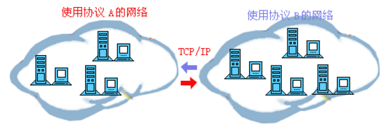
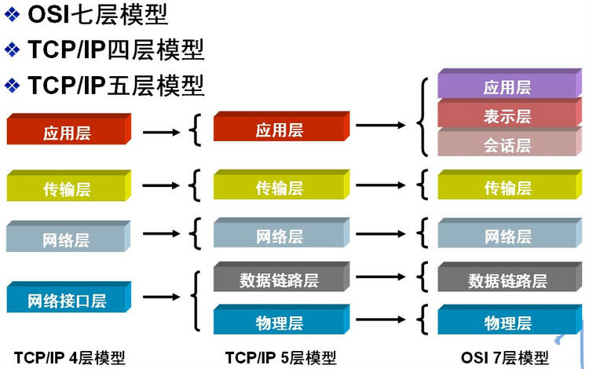
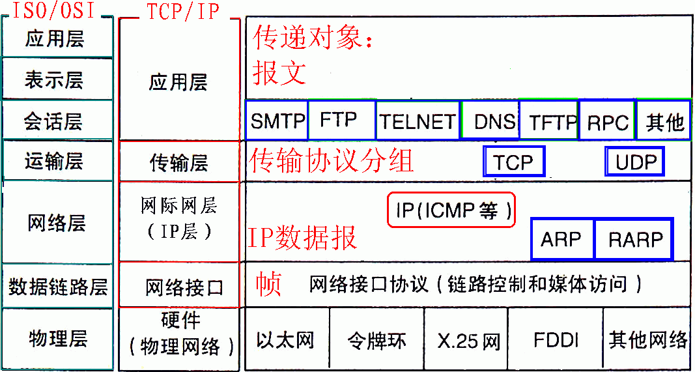
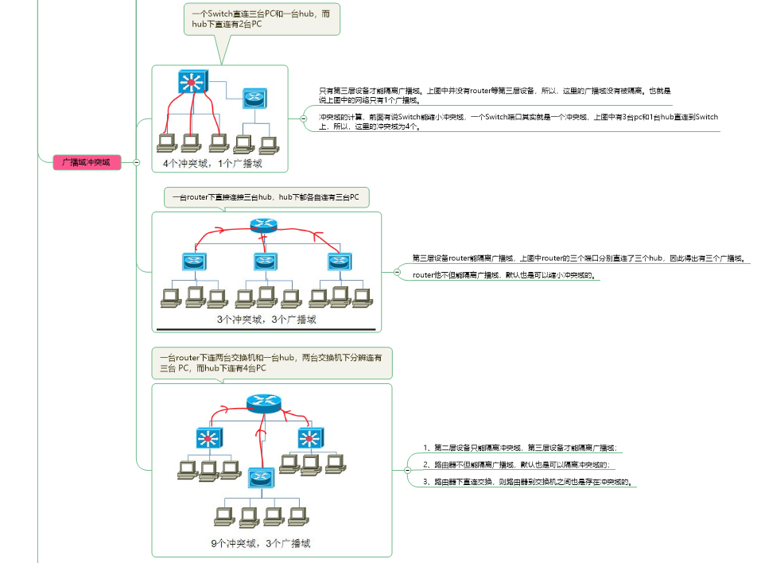
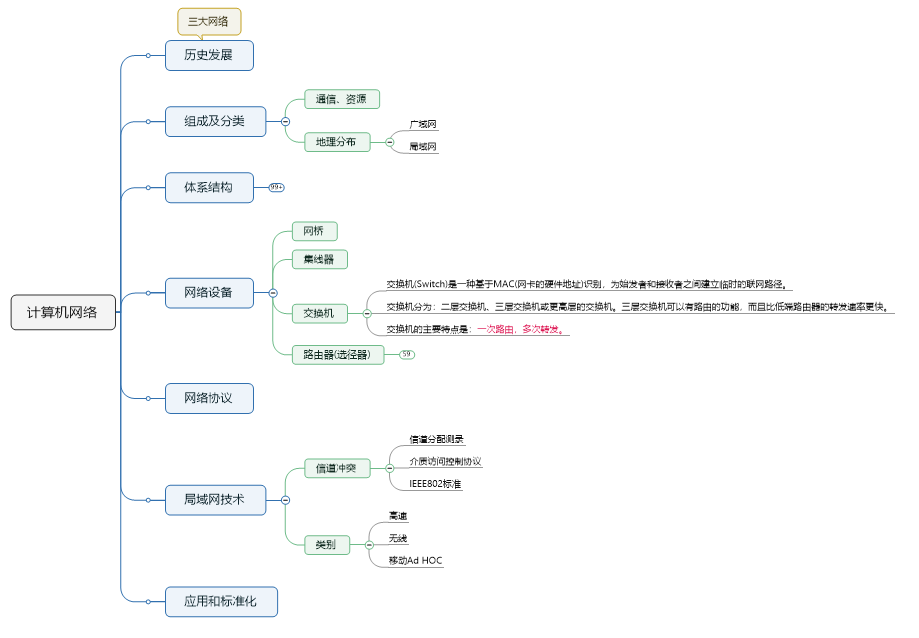
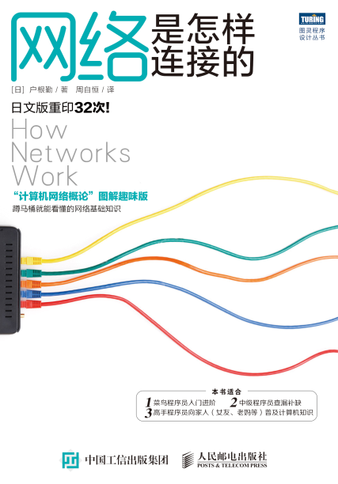

# 计算机网络

## 本仓库内容

1. 计算机网络基本理论
2. 网络相关面试题解析

```
Something I hope you know before go into the coding~
First, please watch or star this repo, I'll be more happy if you follow me.
Bug report, questions and discussion are welcome, you can post an issue or pull a request.
```

## 相关站点

* GitHub地址:<https://github.com/yifengyou/learn-network>

* GibBook地址:<https://yifengyou.gitbooks.io/learn-network/content/>

## 目录

* [计算机网络](README.md)
* [计算机网络体系结构](docs/networkstructure/计算机网络体系结构.md)
    * [OSI模型](docs/networkstructure/OSI模型.md)
    * [TCP/IP](docs/networkstructure/TCP/IP.md)
* [物理层](docs/pysical/物理层.md)
* [数据链路层](docs/datalink/数据链路层.md)
* [网络层](docs/network/网络层.md)
* [传输层](docs/transport/传输层.md)
* [会话层](docs/session/会话层.md)
* [表示层](docs/presentation/表示层.md)
* [应用层](docs/application/应用层.md)
* [物理层](docs/pysical/物理层.md)


## 网络本质论

计算机网络学习的核心内容就是网络协议的学习。网络协议是为计算机网络中进行数据交换而建立的规则、标准或者说是约定的集合。因为不同用户的数据终端可能采取的字符集是不同的，两者需要进行通信，必须要在一定的标准上进行。一个很形象地比喻就是我们的语言，我们大天朝地广人多，地方性语言也非常丰富，而且方言之间差距巨大。A地区的方言可能B地区的人根本无法接受，所以我们要为全国人名进行沟通建立一个语言标准，这就是我们的普通话的作用。同样，放眼全球，我们与外国友人沟通的标准语言是英语，所以我们才要苦逼的学习英语。

计算机网络协议同我们的语言一样，多种多样。而ARPA公司与1977年到1979年推出了一种名为ARPANET的网络协议受到了广泛的热捧，其中最主要的原因就是它推出了人尽皆知的TCP/IP标准网络协议。目前TCP/IP协议已经成为Internet中的“通用语言”，下图为不同计算机群之间利用TCP/IP进行通信的示意图。



## 网络层次划分

为了使不同计算机厂家生产的计算机能够相互通信，以便在更大的范围内建立计算机网络，国际标准化组织（ISO）在1978年提出了“开放系统互联参考模型”，即著名的OSI/RM模型（Open System Interconnection/Reference Model）。它将计算机网络体系结构的通信协议划分为七层，自下而上依次为：物理层（Physics Layer）、数据链路层（Data Link Layer）、网络层（Network Layer）、传输层（Transport Layer）、会话层（Session Layer）、表示层（Presentation Layer）、应用层（Application Layer）。其中第四层完成数据传送服务，上面三层面向用户。

除了标准的OSI七层模型以外，常见的网络层次划分还有TCP/IP四层协议以及TCP/IP五层协议，它们之间的对应关系如下图所示：



## OSI七层网络模型





## 思维导图







## 参考博客

咖啡's blog:<https://blog.csdn.net/body100123/article/details/54315858>
linuxbird:<https://www.cnblogs.com/linuxbird/archive/2013/06/06/3121738.html>
sfzyk:<https://www.cnblogs.com/sfzyk/p/7467040.html>

## 参考书籍



## 总结

```
1. 概念的东西理解记忆
2. 基础永远值得花费90%的精力去学习加强。厚积而薄发~
3. 要理解一个软件系统的真正运行机制，一定要阅读其源代码~
```
